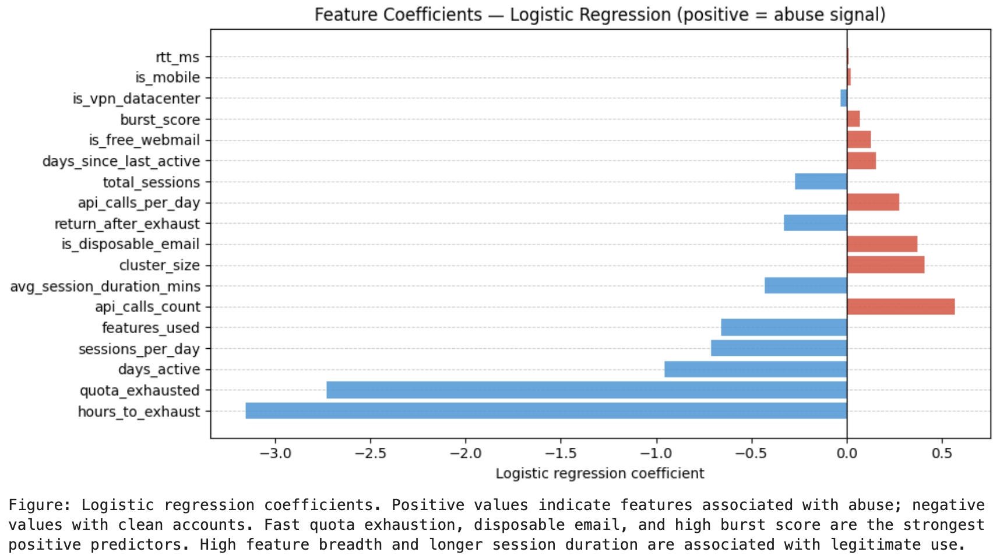

# ghost-watcher


> The hardest part of detecting subscription abuse isn't the model — it's defining what abuse is.

---

In a comment thread about AI subscriptions, someone says the quiet part out loud: they have 6 OpenAI accounts. When one runs out, they switch to the next.

Scroll any AI forum long enough and you'll find a dozen more just like it.

This project is about the measurement problem underneath that behavior. How do you define subscription abuse when the definition is genuinely contested? How do you measure something you can't directly observe? How do you put a number on the revenue impact without lying to yourself?  

---

## The Problem in Plain Terms

AI subscription products — Claude, ChatGPT, Gemini, etc — are uniquely vulnerable to a specific type of abuse: users creating multiple free or trial accounts to avoid paying. The product has high perceived value and near-zero marginal cost per user, which makes the free tier extremely attractive to game.

The detection problem sounds tractable: find accounts that share device fingerprints, IPs, or behavioral patterns. But the moment you try to label training data, you hit a wall. What exactly is abuse? A developer who creates a second account to test API behavior? A family that shares a laptop? A researcher running evals across multiple contexts? The signal exists. The ground truth does not.

This framework confronts that wall directly rather than papering over it.

---

## Repository Structure

```
ghost-watcher/
├── 01_background/
│   ├── the_free_rider_problem.md          # Economic framing: why this happens at all
│   └── why_ai_products_are_uniquely_vulnerable.md  # Why AI products are the target
│
├── 02_problem_framing/
│   ├── what_is_subscription_abuse.md      # Scope definition: what's in, what's out
│   └── why_definition_is_the_hard_part.md # Core thesis: label ambiguity as the real problem
│
├── 03_metrics/
│   ├── taxonomy.md                        # Metrics organized by observability
│   └── abuse_confidence_score.md         # Three-tier label system (not binary)
│
├── 04_data/
│   ├── rba_dataset_overview.md           # Source dataset description
│   ├── schema_design.md                  # Full augmented schema design
│   └── simulate_abuse_accounts.py        # Synthetic cohort generator
│
├── 05_detection/
│   ├── rule_based.ipynb                  # Heuristic rules with precision/recall analysis
│   └── ml_based.ipynb                    # Behavioral fingerprinting model with SHAP
│
├── 06_business_impact/
│   └── revenue_leakage_model.ipynb       # Revenue loss estimation with sensitivity analysis
│
└── 07_appendix/
    └── references.md                     # Sources and further reading
```

---

## Module Guide

| Module | What it answers |
|--------|----------------|
| [01_background](01_background/) | Why does subscription abuse exist, and why are AI products the target? |
| [02_problem_framing](02_problem_framing/) | What exactly are we trying to detect, and why is labeling so hard? |
| [03_metrics](03_metrics/) | What can we actually measure, and how confident should we be? |
| [04_data](04_data/) | Where does the data come from, and how is the synthetic dataset constructed? |
| [05_detection](05_detection/) | How do rule-based and ML detection approaches perform, and where do they fail? |
| [06_business_impact](06_business_impact/) | What is the measurable revenue impact of ghost accounts? |

---

## Preview

**Feature importance (SHAP) — behavioral fingerprinting model:**



---

## Running the Code

**Prerequisites:**
```bash
python3.13 -m venv .venv
source .venv/bin/activate
python -m pip install --upgrade pip
pip install -r requirements.txt
```

**Generate synthetic data first:**
```bash
python 04_data/simulate_abuse_accounts.py
```

This creates `data/simulated_users.csv`. Then run the notebooks in order: `rule_based.ipynb` → `ml_based.ipynb` → `revenue_leakage_model.ipynb`.

```bash
jupyter lab
```

---

## What This Is (and Isn't)

This is an analytical framework and portfolio project. It is not a production detection system. It does not provide instructions for evading detection. It does not claim its simulated results generalize to real companies without calibration.

What it does claim: the *approach* — three-tier confidence labels, behavioral fingerprinting as complement to rule-based signals, and honest uncertainty quantification in revenue models — is the right way to think about this problem, regardless of the specific numbers.

---

*Author: Viola | 2026 | [MIT License](LICENSE)*
